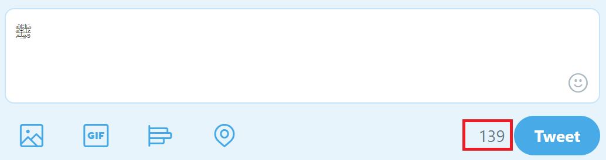

# String Series: String Length
## TL;DR
String length is complicated, may cause bugs in your code. Use an existing, popular, and well tested library whenever possible.

## WTF is this 
This is a github markdown series, where I will talk about things I have learnt over the years, tips and tricks, and stuff I learnt from my mistakes. In short things that haunt me. Here I will talk about string length. Let us get to it …

## In theory it is simple
But… when I was first introduced to string length, it was defined as the number of characters in a string. The first language I worked with was C, and the *string* was an array of `char` type that terminated with a `null` character. The length, if needed, was computed once using `strlen`. That functions counts characters until it reaches the `null` character (in hex `0x00` or `\0`). Passed my programming 101 test, one thing led to another, graduated, got a job. I started working on some projects, all worked great until I started to worked great, so I shipped it (published it on then popular code sharing website). I thought everything would be great, *BUT* you knew this was coming, it was *NOT*.

What is the length of **Orange**? you are right it is *six*. What is the length of **…**? you are right it is *three*, **just kidding**, it is *one*. What is the length of [**ᓄᖅᑲᕆᑦ**](https://en.wikipedia.org/wiki/Inuktitut_syllabics)? It is *five*. What is the length of [**ﷺ‎**](https://en.wikipedia.org/wiki/Arabic_script_in_Unicode#Word_ligatures)? one, two, three …, that is an entire phrase in Arabic, it is technically *one* character. Let us use my favorite character counter, [Twitter](https://developer.twitter.com/en/docs/basics/counting-characters). Let us do one more, What is the length of this **🇺🇸**? It is actually *two*.

 It is not always easy to determine this visually. At this point I realized that there are *three* measures for string length. Take the word **ಕನ್ನಡ**.

1. **Count of Characters**: This is the number of characters according to the character script. **ಕನ್ನಡ** has 3 characters.
2. **Count of Character Units**: This is the number of `chars`, `wchar_t`, `unsigned short`, etc, used to store the string by your preferred language. **ಕನ್ನಡ** takes 3 symbols and 2 modifiers, hence 5 character units. It looks like this, `<U+0C95><U+0CA8><U+0CCD><U+0CA8><U+0CA1>`. This is what programming languages consider as length. The length values in the examples above were of this form.
3. **Count of Bytes**: This is the number of bytes it takes to store the string. **ಕನ್ನಡ** takes 15 bytes, it looks like this `e0 b2 95 e0 b2 a8 e0 b3 8d e0 b2 a8 e0 b2 a1`.

I Know, I said *three*, but I have to mention this one. You won't need it often unless you own a UI framework, like WPF, X, Swing, etc.

4. **Text Extent** or **Measure**: The size of the string in display units, based on given *font* and *display device*. This will give the width and height of a box that can contain the text.  

Windows has the [strsafe](https://msdn.microsoft.com/en-us/library/windows/desktop/ff468908(v=vs.85).aspx) APIs, with `*Cch*` for functions that use character units, and `*Cb*` for functions that use bytes.

## Off-by-one bug : String length edition
There is one other thing about strings that has bitten me several times: The `null` terminator. Some APIs use string length excluding the `null` (such as `strncat`), or including the `null` (such as `memcpy`). Some libraries use `string` class, and store the length along with the string, such as the conveniently `string` C/C++/C#, `String` in java, `BSTR` in OLE Automation on Windows. Let us go back to **ಕನ್ನಡ**, when you save that to a file, with UTF-8 encoding, you will see that the file size is 17 bytes. This is because, strings that require more than one byte to represent a character use `null null` (called double-null) as terminator. So **ಕನ್ನಡ** is stored as `e0 b2 95 e0 b2 a8 e0 b3 8d e0 b2 a8 e0 b2 a1 00 00`. All this meant, it is very easy while coding to introduce off-by-one bug, *very* easy.

## This is madness. This is unicode.
If you have to deal with strings in a globalization context, and you have native code, then consider using [**International Components for Unicode**](icu-project.org). Managed languages make this easy, until you have to interface with another platform or un-managed library. If you are writing a parser, string formatter, serializer, deserializer, use existing format (JSON, XML, YAML, BSON, etc).
